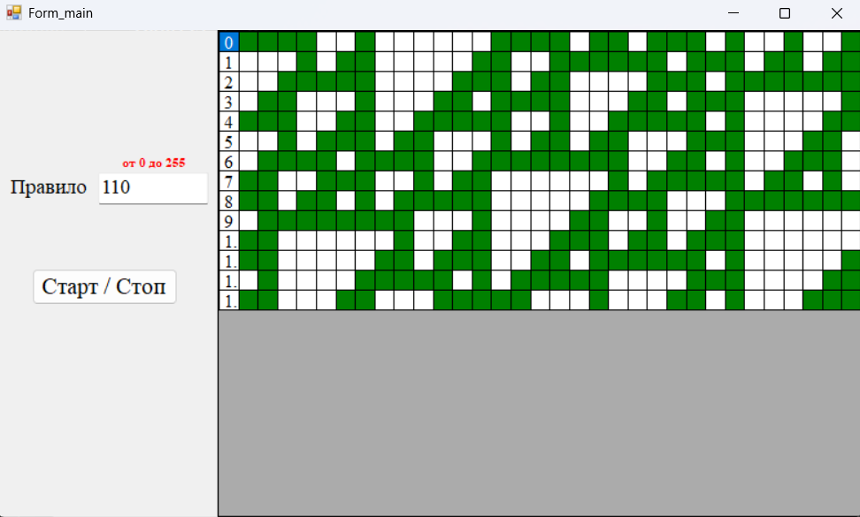

# 🧩 ElementaryCellularAutomaton

Simulation of **elementary one-dimensional cellular automata** based on Wolfram's rules (0–255).  
Симуляция **элементарных одномерных клеточных автоматов** по правилам Вольфрама (0–255).

---

## 📌 About / О проекте

🎓 Developed for a Simulation Modeling course.  
💡 Implements dynamic visualization of automaton states over time.  
🖱 Supports any rule number from 0 to 255.

🎓 Разработано в рамках курса по имитационному моделированию.  
💡 Реализует пошаговую визуализацию изменений состояния клеточного автомата.  
🖱 Поддерживает любое правило от 0 до 255.

---

## 🔧 Features / Возможности

- 🛠 User-defined rule (0–255)  
  Пользователь сам задаёт правило (0–255)

- 🎲 Random initial state generation  
  Генерация случайного начального состояния

- 📊 Visualization in a DataGridView table with color coding  
  Визуализация в виде таблицы DataGridView с цветовой индикацией

- ♾ Periodic boundary conditions (first and last cells are neighbors)  
  Циклические граничные условия (первая и последняя клетка — соседи)

- ⏯ Start/Stop simulation control  
  Кнопка запуска/остановки симуляции

---

## 📁 Structure / Структура

- `Form_main.cs` — main form logic, initialization, drawing, rule application  
  Основная форма: инициализация, отрисовка, применение правил

---

## 🖼 Screenshots / Скриншоты

  
*Рис. 1 — Пример генерации клеточного автомата по правилу 110*

---
